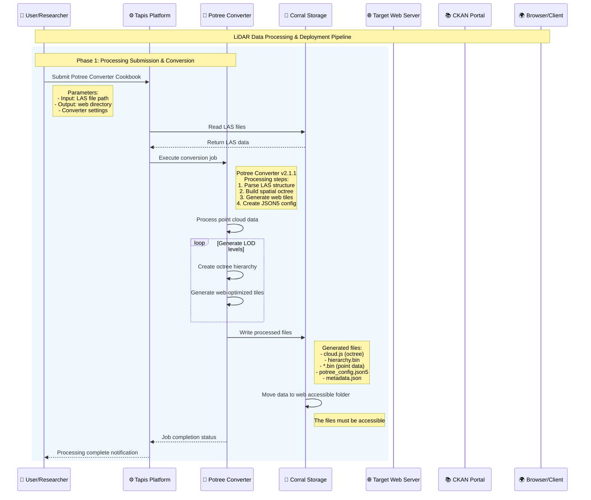
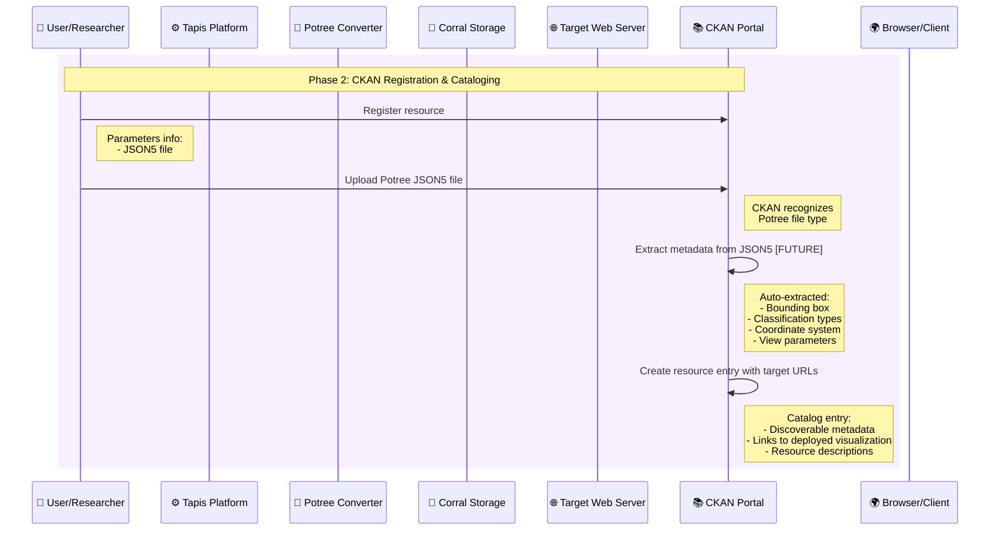
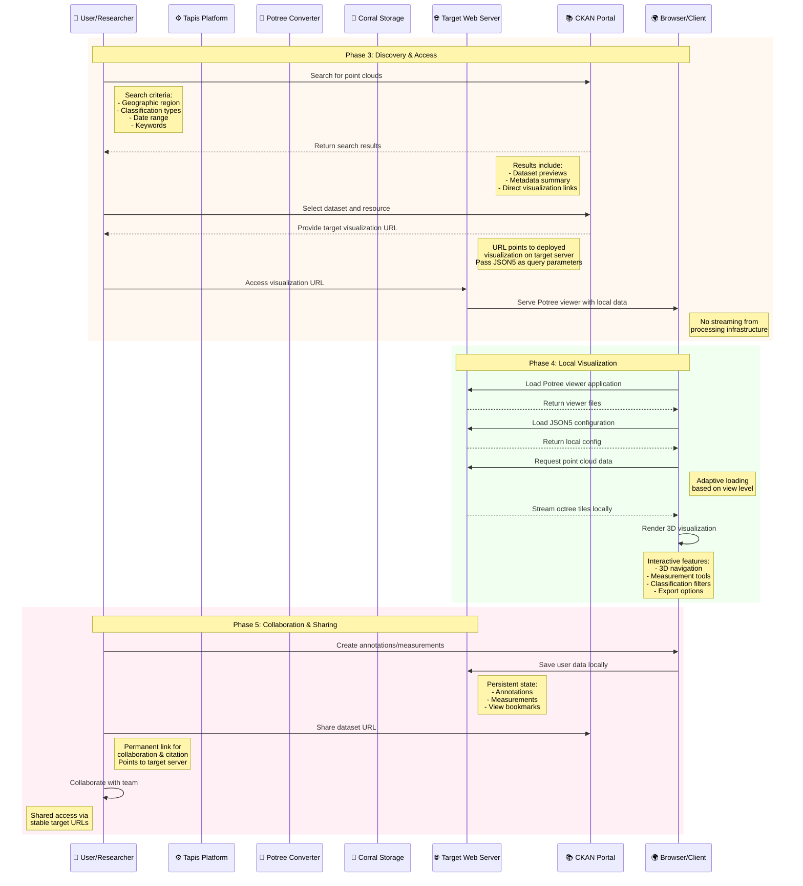
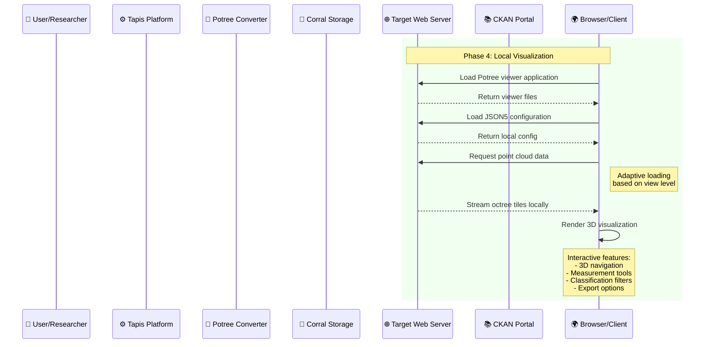
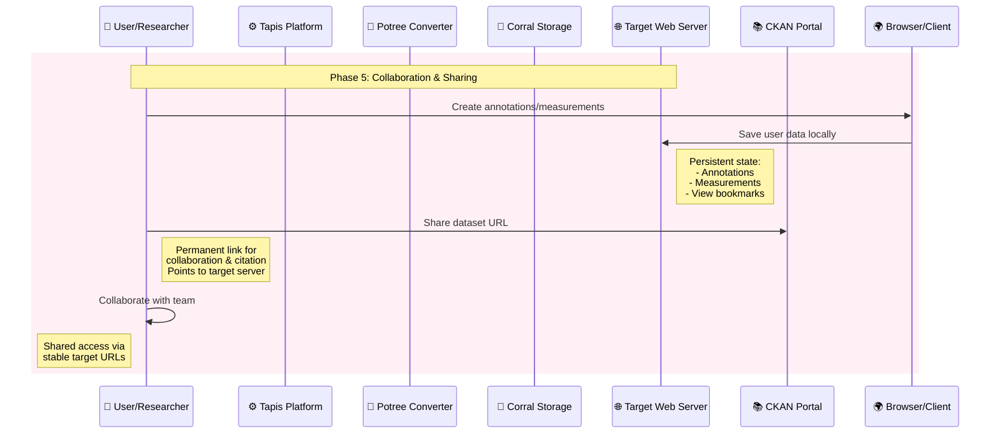

```mermaid
sequenceDiagram
    participant User as 👤 User/Researcher
    participant Tapis as ⚙️ Tapis Platform
    participant Potree as 🔧 Potree Converter
    participant Corral as 💾 Corral Storage
    participant Target as 🌐 Target Web Server
    participant CKAN as 📚 CKAN Portal
    participant Browser as 🌍 Browser/Client

    Note over User,Browser: LiDAR Data Processing & Deployment Pipeline

    %% Processing Submission
    rect rgb(240, 248, 255)
        Note over User,Potree: Phase 1: Processing Submission & Conversion
        User->>Tapis: Submit  Potree Converter Cookbook
        Note right of User: Parameters:<br/>- Input: LAS file path<br/>- Output: web directory<br/>- Converter settings

        Tapis->>Corral: Read LAS files
        Corral-->>Tapis: Return LAS data

        Tapis->>Potree: Execute conversion job
        Note right of Potree: Potree Converter v2.1.1<br/>Processing steps:<br/>1. Parse LAS structure<br/>2. Build spatial octree<br/>3. Generate web tiles<br/>4. Create JSON5 config

        Potree->>Potree: Process point cloud data
        loop Generate LOD levels
            Potree->>Potree: Create octree hierarchy
            Potree->>Potree: Generate web-optimized tiles
        end

        Potree->>Corral: Write processed files
        Note right of Corral: Generated files:<br/>- cloud.js (octree)<br/>- hierarchy.bin<br/>- *.bin (point data)<br/>- potree_config.json5<br/>- metadata.json


        Corral->>Corral: Move data to web accessible folder
        Note right of Corral: The files must be accessible

        Potree-->>Tapis: Job completion status
        Tapis-->>User: Processing complete notification
    end

```

```mermaid
sequenceDiagram
    participant User as 👤 User/Researcher
    participant Tapis as ⚙️ Tapis Platform
    participant Potree as 🔧 Potree Converter
    participant Corral as 💾 Corral Storage
    participant Target as 🌐 Target Web Server
    participant CKAN as 📚 CKAN Portal
    participant Browser as 🌍 Browser/Client

    %% CKAN Registration Phase
    rect rgb(248, 240, 255)
        Note over User,CKAN: Phase 2: CKAN Registration & Cataloging
        User->>CKAN: Register resource
        Note right of User: Parameters info:<br/>- JSON5 file

        User->>CKAN: Upload Potree JSON5 file
        Note right of CKAN: CKAN recognizes<br/>Potree file type

        CKAN->>CKAN: Extract metadata from JSON5 [FUTURE]
        Note right of CKAN: Auto-extracted:<br/>- Bounding box<br/>- Classification types<br/>- Coordinate system<br/>- View parameters

        CKAN->>CKAN: Create resource entry with target URLs
        Note right of CKAN: Catalog entry:<br/>- Discoverable metadata<br/>- Links to deployed visualization<br/>- Resource descriptions
    end

```

```mermaid
sequenceDiagram
    participant User as 👤 User/Researcher
    participant Tapis as ⚙️ Tapis Platform
    participant Potree as 🔧 Potree Converter
    participant Corral as 💾 Corral Storage
    participant Target as 🌐 Target Web Server
    participant CKAN as 📚 CKAN Portal
    participant Browser as 🌍 Browser/Client

    %% Discovery & Access Phase
    rect rgb(255, 248, 240)
        Note over User,Browser: Phase 3: Discovery & Access
        User->>CKAN: Search for point clouds
        Note right of User: Search criteria:<br/>- Geographic region<br/>- Classification types<br/>- Date range<br/>- Keywords

        CKAN-->>User: Return search results
        Note left of CKAN: Results include:<br/>- Dataset previews<br/>- Metadata summary<br/>- Direct visualization links

        User->>CKAN: Select dataset and resource
        CKAN-->>User: Provide target visualization URL
        Note left of CKAN: URL points to deployed<br/>visualization on target server<br> Pass JSON5 as query parameters

        User->>Target: Access visualization URL
        Target->>Browser: Serve Potree viewer with local data
        Note right of Browser: No streaming from<br/>processing infrastructure
    end

    %% Visualization Phase
    rect rgb(240, 255, 240)
        Note over Browser,Target: Phase 4: Local Visualization
        Browser->>Target: Load Potree viewer application
        Target-->>Browser: Return viewer files

        Browser->>Target: Load JSON5 configuration
        Target-->>Browser: Return local config

        Browser->>Target: Request point cloud data
        Note right of Browser: Adaptive loading<br/>based on view level

        Target-->>Browser: Stream octree tiles locally
        Browser->>Browser: Render 3D visualization

        Note over Browser: Interactive features:<br/>- 3D navigation<br/>- Measurement tools<br/>- Classification filters<br/>- Export options
    end

    %% Collaboration & Sharing
    rect rgb(255, 240, 245)
        Note over User,Target: Phase 5: Collaboration & Sharing
        User->>Browser: Create annotations/measurements
        Browser->>Target: Save user data locally
        Note right of Target: Persistent state:<br/>- Annotations<br/>- Measurements<br/>- View bookmarks

        User->>CKAN: Share dataset URL
        Note right of User: Permanent link for<br/>collaboration & citation<br/>Points to target server

        User->>User: Collaborate with team
        Note left of User: Shared access via<br/>stable target URLs
    end
```

```mermaid
sequenceDiagram
    participant User as 👤 User/Researcher
    participant Tapis as ⚙️ Tapis Platform
    participant Potree as 🔧 Potree Converter
    participant Corral as 💾 Corral Storage
    participant Target as 🌐 Target Web Server
    participant CKAN as 📚 CKAN Portal
    participant Browser as 🌍 Browser/Client


    %% Visualization Phase
    rect rgb(240, 255, 240)
        Note over Browser,Target: Phase 4: Local Visualization
        Browser->>Target: Load Potree viewer application
        Target-->>Browser: Return viewer files

        Browser->>Target: Load JSON5 configuration
        Target-->>Browser: Return local config

        Browser->>Target: Request point cloud data
        Note right of Browser: Adaptive loading<br/>based on view level

        Target-->>Browser: Stream octree tiles locally
        Browser->>Browser: Render 3D visualization

        Note over Browser: Interactive features:<br/>- 3D navigation<br/>- Measurement tools<br/>- Classification filters<br/>- Export options
    end
```

```mermaid
sequenceDiagram
    participant User as 👤 User/Researcher
    participant Tapis as ⚙️ Tapis Platform
    participant Potree as 🔧 Potree Converter
    participant Corral as 💾 Corral Storage
    participant Target as 🌐 Target Web Server
    participant CKAN as 📚 CKAN Portal
    participant Browser as 🌍 Browser/Client


    %% Collaboration & Sharing
    rect rgb(255, 240, 245)
        Note over User,Target: Phase 5: Collaboration & Sharing
        User->>Browser: Create annotations/measurements
        Browser->>Target: Save user data locally
        Note right of Target: Persistent state:<br/>- Annotations<br/>- Measurements<br/>- View bookmarks

        User->>CKAN: Share dataset URL
        Note right of User: Permanent link for<br/>collaboration & citation<br/>Points to target server

        User->>User: Collaborate with team
        Note left of User: Shared access via<br/>stable target URLs
    end
```
