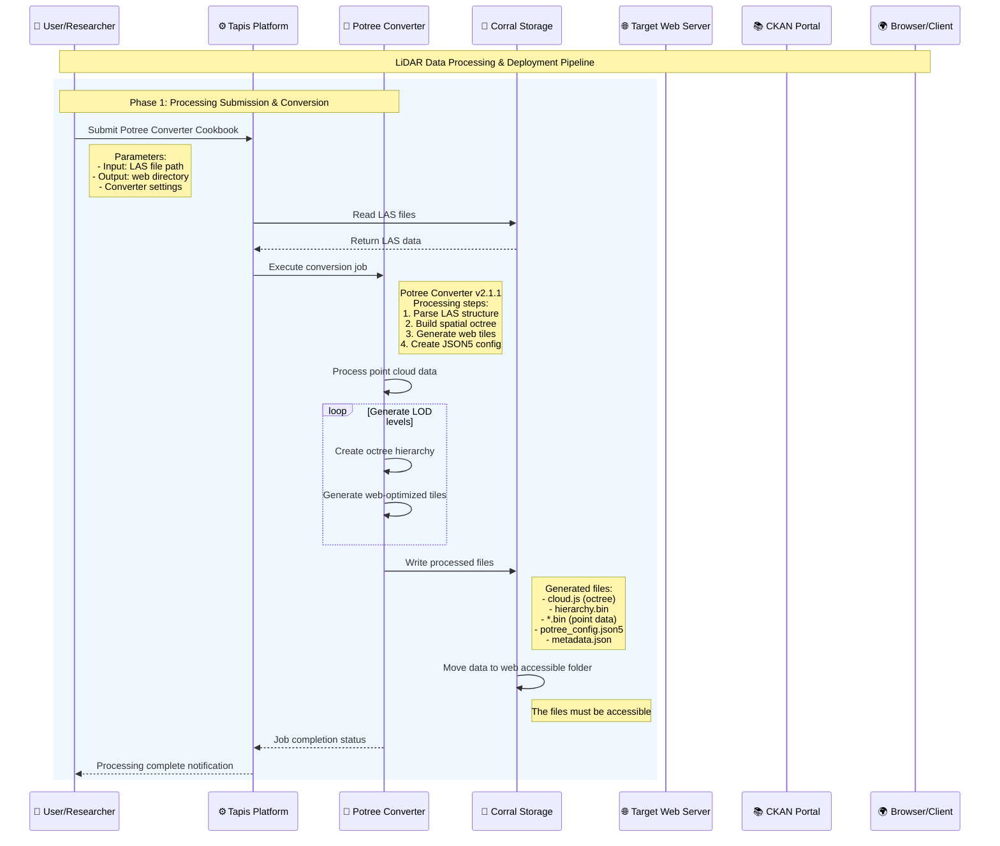
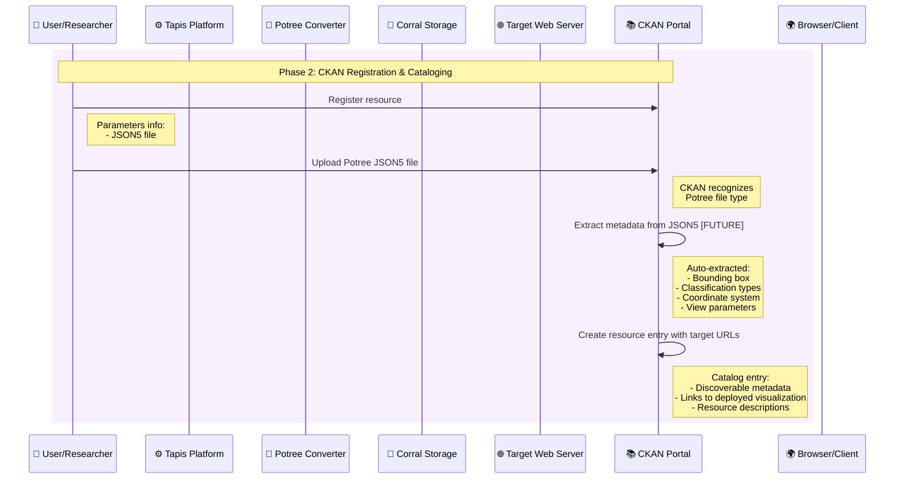
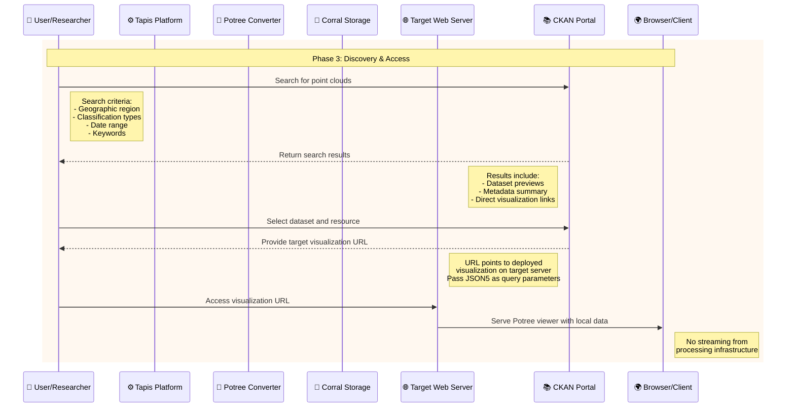
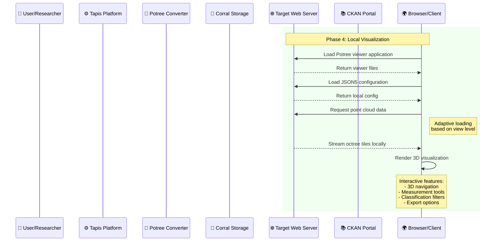
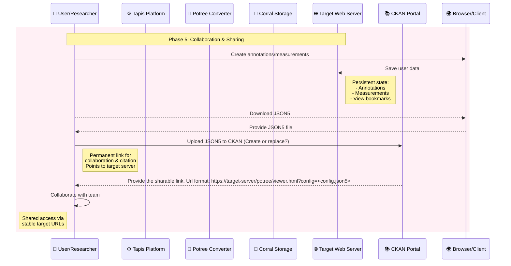

# LiDAR Visualization Pipeline - Phase Documentation

## Pipeline Overview

This streamlined LiDAR processing pipeline transforms raw point cloud data into web-accessible visualizations through five key phases. The pipeline emphasizes automated processing, direct web accessibility, and efficient resource management within existing infrastructure.

---

## Phase 1: Processing Submission & Conversion

**Objective**: Convert raw LAS files into web-optimized point cloud formats using Tapis platform orchestration.



### Key Activities

#### Job Submission

- **User Action**: Submit Potree Converter Cookbook to Tapis platform
- **Parameters Specified**:
  - Input LAS file path in Corral storage
  - Output web directory location
  - Converter settings and optimization parameters

#### Data Processing Workflow

```
Tapis Platform → Read LAS files from Corral Storage
Tapis Platform → Execute Potree Converter v2.1.1
Potree Converter → Process point cloud data through multiple steps:
    1. Parse LAS structure and metadata
    2. Build spatial octree hierarchy
    3. Generate web-optimized tiles
    4. Create JSON5 configuration file
```

#### Iterative Processing

- **Level of Detail Generation**: Creates multiple resolution levels for adaptive rendering
- **Octree Hierarchy**: Builds spatial data structure for efficient visualization
- **Web Optimization**: Generates tiles optimized for browser-based streaming

#### Output Generation

**Generated Files**:

- `cloud.js` - Main octree structure file
- `hierarchy.bin` - Spatial hierarchy data
- `*.bin` files - Point data at various detail levels
- `potree_config.json5` - Visualization configuration
- `metadata.json` - Processing and spatial metadata

#### Critical Infrastructure Step

- **Data Accessibility**: Files moved to web-accessible folder within Corral
- **Direct Access**: Ensures processed data can be served directly without additional transfers
- **Performance Optimization**: Eliminates need for external data movement

### Outcomes

- Raw LAS data transformed into web-ready format
- All files accessible via web URLs
- Processing completion notification sent to user
- Data ready for immediate cataloging and visualization

---

## Phase 2: CKAN Registration & Cataloging

**Objective**: Register processed point cloud data as discoverable resources in the CKAN data portal.



### Key Activities

#### Resource Registration

- **User Action**: Register new resource in CKAN portal
- **Primary Asset**: Upload Potree JSON5 configuration file
- **Resource Type**: CKAN recognizes and categorizes as Potree visualization

#### CKAN File Type Recognition

- **Automatic Detection**: CKAN identifies JSON5 as Potree configuration
- **Specialized Handling**: Applies appropriate metadata extraction and preview capabilities
- **Resource Classification**: Categorizes for specialized search and discovery

#### Metadata Extraction (Future Enhancement)

**Planned Auto-extraction from JSON5**:

- **Spatial Bounds**: Geographic bounding box coordinates
- **Classification Schema**: Point cloud classification types and colors
- **Coordinate System**: Spatial reference system information
- **View Parameters**: Default camera positions and rendering settings

#### Catalog Entry Creation

**Generated Catalog Information**:

- **Discoverable Metadata**: Searchable dataset description and keywords
- **Direct Visualization Links**: URLs pointing to web-accessible files
- **Resource Descriptions**: Technical details and usage information
- **Access Information**: Direct links to visualization interface

### Outcomes

- Point cloud data becomes discoverable through CKAN search
- Standardized metadata enables efficient filtering and discovery
- Direct links established to visualization resources
- Foundation for collaborative data sharing

---

## Phase 3: Discovery & Access

**Objective**: Enable users to find, evaluate, and access point cloud visualizations through the CKAN portal.



### Key Activities

#### Data Discovery

- **Search Interface**: Users query CKAN using multiple criteria
- **Search Parameters**:
  - Geographic region and spatial extent
  - Classification types (vegetation, buildings, ground, etc.)
  - Date ranges and collection periods
  - Keywords and descriptive terms

#### Search Results Presentation

**CKAN Returns**:

- **Dataset Previews**: Thumbnail images or summary visualizations
- **Metadata Summary**: Key dataset characteristics and parameters
- **Direct Visualization Links**: One-click access to interactive viewers

#### Dataset Selection & Access

- **Resource Selection**: User chooses specific dataset and resource
- **URL Generation**: CKAN provides target visualization URL
- **Parameter Passing**: JSON5 configuration passed as query parameters
- **Seamless Transition**: Direct routing to visualization interface

#### Technical Implementation

- **Target Server Access**: URLs point to web-accessible Corral locations
- **No Processing Infrastructure Load**: Eliminates streaming from TACC processing systems
- **Optimized Performance**: Direct file serving for improved user experience

### Outcomes

- Efficient discovery of relevant point cloud datasets
- Immediate access to interactive visualizations
- Reduced load on processing infrastructure
- Streamlined user workflow from search to visualization

---

## Phase 4: Local Visualization

**Objective**: Provide interactive 3D point cloud visualization with full analysis capabilities.



### Key Activities

#### Viewer Application Loading

- **Potree Viewer Delivery**: Target server serves complete visualization application
- **Local Data Access**: All point cloud data served from same infrastructure
- **Configuration Loading**: JSON5 settings applied to viewer initialization by query parameters (https://<target-server>/potree/viewer.html?config=<config.json5>)

#### Data Streaming & Rendering

```
Browser → Read the JSON5 configuration
Browser -> Request point cloud data from Target Server
Target Server → Stream octree tiles based on view level
Browser → Adaptive loading based on user navigation
Browser → Real-time 3D rendering and visualization
```

#### Interactive Capabilities

**Available Features**:

- **3D Navigation**: Pan, zoom, rotate with multiple camera modes
- **Measurement Tools**: Distance, area, volume, and height calculations
- **Export Options**: Screenshot capture and data subset downloads

#### Performance Optimization

- **Level of Detail**: Automatic resolution adjustment based on view distance
- **Adaptive Loading**: Loads only visible point cloud sections
- **Local Processing**: All rendering performed client-side for responsiveness
- **GPU Acceleration**: Utilizes WebGL for smooth interaction

### Outcomes

- High-performance 3D point cloud visualization
- Complete analysis toolkit for scientific research
- No software installation requirements

---

## Phase 5: Collaboration & Sharing

**Objective**: Enable persistent data analysis, team collaboration, and long-term data sharing.



### Key Activities

#### User Interaction & Analysis

- **Annotation Creation**: Users add spatial annotations and descriptive labels
- **Measurement Recording**: Precise measurements saved with project context
- **Analysis Documentation**: Research findings documented within visualization

#### Data Persistence

**Saved Information**:

- **Annotations**: Spatial markers with descriptive text
- **Measurements**: Quantitative analysis results
- **View Bookmarks**: Saved camera positions and visualization states
- **Analysis Sessions**: Complete workflow documentation

#### Collaboration Features

- **Team Access**: Shared visualization URLs for collaborative analysis
- **Version Control**: Consistent access to specific dataset versions
- **Cross-Platform Sharing**: URLs work across different devices and browsers

### Outcomes

- Persistent research analysis capabilities
- Effective team collaboration tools
- Reliable sharing

---

## Technical Architecture Benefits

### Infrastructure Efficiency

- **Separated Concerns**: Processing and serving infrastructure optimized independently
- **Scalable Deployment**: Multiple target servers can host the same datasets
- **Cost Optimization**: Efficient resource utilization across pipeline stages

### User Experience

- **Fast Access**: Local data serving provides optimal performance
- **Reliable URLs**: Stable links for bookmarking and sharing
- **No Dependencies**: Browser-based access without software installation
- **Cross-Platform**: Consistent experience across devices and operating systems

### Data Management

- **FAIR Compliance**: Findable, Accessible, Interoperable, Reusable data
- **Standardized Formats**: JSON5 configuration enables consistent metadata
- **Automated Workflows**: Minimal manual intervention required
- **Quality Control**: Validation and verification throughout pipeline

### Research Impact

- **Enhanced Discovery**: Rich metadata enables precise dataset finding
- **Collaborative Analysis**: Shared URLs facilitate team research
- **Educational Value**: Accessible visualizations support teaching and outreach
